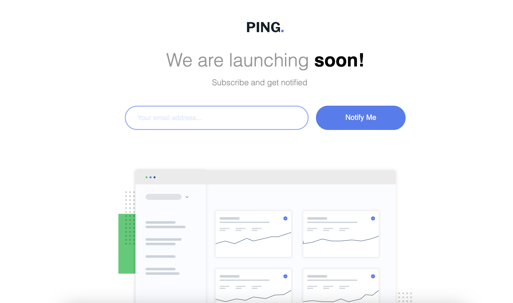

<h1 align="center">Ping single column coming soon page</h1>

 <a align="center" href="https://ctrlaltsudo.github.io/Ping-single-column-coming-soon-page/">Live Demo</a>

 <a align="center" href="https://www.frontendmentor.io/challenges/ping-single-column-coming-soon-page-5cadd051fec04111f7b848da/hub">Solution Page</a>

<h2 align="center">Project Screenshot<h2>

  </img>

## Description

This is a Frontend Mentor challenge, click the link above to visit the challenge page. 

## Built with 

HTML

CSS

Flexbox

Vanilla JS

## Authors

<a href="https://github.com/CtrlAltSudo">CtrlAltSudo</a>.

## Acknowledgments 

Stack overflow, Google and ChatGPT still prove to be valuable resources! 